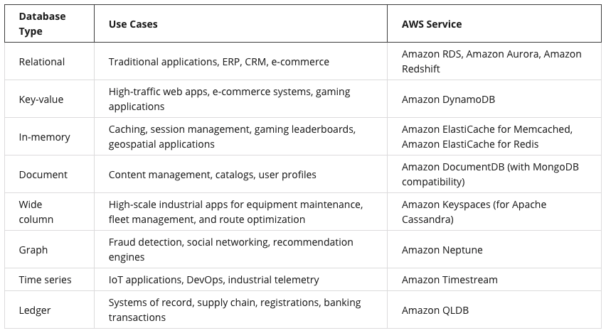

# Databases on AWS

## Cloud Research
- Today, I've learned about AWS databases which can separated into 2 types: relational database, and NoSQL database. With those two types of database, each one of them is suitable for different use cases. Furthermore, I've got hands-on creating AWS DynamoDB for the project as well.

## __What Is a Relational Database Management System?__
A relational database management system (RDBMS) lets you create, update, and administer a relational database. Here are some common examples of relational database management systems:
- MySQL
- PostgresQL
- Oracle
- SQL server
- Amazon Aurora
You communicate with most RDBMS by using Structured Query Language (SQL) queries.

## __What Is Amazon DynamoDB?__
Amazon DynamoDB is a fully managed NoSQL database service that provides fast and predictable performance with seamless scalability. DynamoDB lets you offload the administrative burdens of operating and scaling a distributed database so that you don't have to worry about hardware provisioning, setup and configuration, replication, software patching, or cluster scaling. 

## __AWS Database Services__
AWS has a variety of different database options for different use cases. Use the table below to get a quick look at the AWS database portfolio.

## Social Proof
I'm not going to post my progression on social media.
