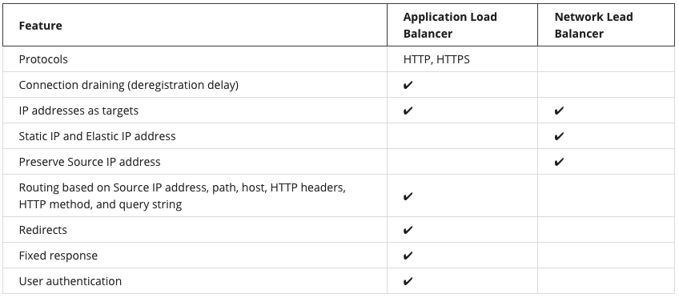

# Optimization

## Cloud Research
- Today, I've learned about basic monitoring and its purposes. AWS CloudWatch provides us many different pre-set metrics that we can select them for monitoring something like CPU, and memory utilization on EC2 intances. AWS CloudWatch has an alarm feature which can notify us when a value on any metric exceed a threshold as well.

## __What’s a Load Balancer?__
Load balancing refers to the process of distributing tasks across a set of resources. In the case of the corporate directory application, the resources are EC2 instances that host the application, and the tasks are the different requests being sent. It’s time to distribute the requests across all the servers hosting the application using a load balancer.

### __Select Between ELB Types__

## __Use Amazon EC2 Auto Scaling__
The EC2 Auto Scaling service works to add or remove capacity to keep a steady and predictable performance at the lowest possible cost. By adjusting the capacity to exactly what your application uses, you only pay for what your application needs. And even with applications that have steady usage, EC2 Auto Scaling can help with fleet management. If there is an issue with an EC2 instance, EC2 Auto Scaling can automatically replace that instance. This means that EC2 Auto Scaling helps both to scale your infrastructure and ensure high availability. 

### __Configure EC2 Auto Scaling Components__
There are three main components to EC2 Auto Scaling.
- __Launch template or configuration__: What resource should be automatically scaled?
- __EC2 Auto Scaling Group__: Where should the resources be deployed?
- __Scaling policies__: When should the resources be added or removed?

## Social Proof
I'm not going to post my progression on social media.
