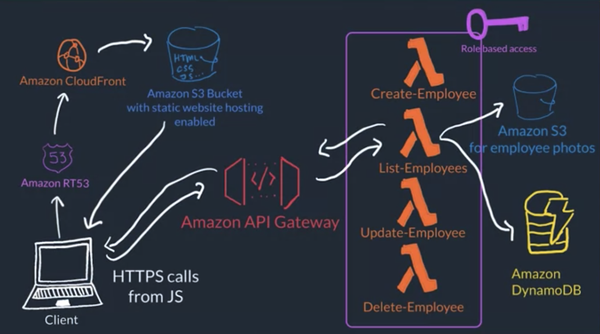

# Going Serverless

## Cloud Research
- Today, I've learned about serving an presentation layer which is our front-end website on serverless. It can be separated out from EC2 instances, and use JavaScript to communicate with a database and static files.

## Social Proof
I'm not going to post my progression on social media.
