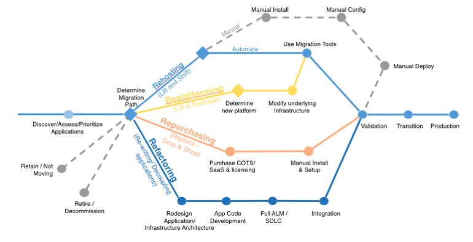

# Cloud Adoption Framework

## Cloud Research
- Today, I've learned about 6 Application Migration Strategies to a cloud.

## __“The 6 R’s”: 6 Application Migration Strategies__

### __Re-host__ (Referred to as a “lift and shift.”)
Move applications without changes. In large-scale, legacy migrations, organizations are looking to move quickly to meet business objectives. The majority of these applications are re-hosted. GE Oil & Gas found that, even without implementing any cloud optimizations, it could save roughly 30% of its costs by re-hosting.

Most re-hosting can be automated with tools (e.g. AWS VM Import/Export). Some customers prefer to do this manually as they learn how to apply their legacy systems to the new cloud platform.

Applications are easier to optimize/re-architect once they’re already running in the cloud. Partly because your organization will have developed the skills to do so, and partly because the hard part — migrating the application, data, and traffic — has already been done.

### __Re-platform__ (Referred to as “lift, tinker, and shift.”)
Make a few cloud optimizations to achieve a tangible benefit. You will not change the core architecture of the application. For example, reduce the amount of time you spend managing database instances by migrating to a database-as-a-service platform like Amazon Relational Database Service (Amazon RDS), or migrating your application to a fully managed platform like AWS Elastic Beanstalk.

A large media company migrated hundreds of web servers that it ran on-premises to AWS. In the process, it moved from WebLogic (a Java application container that requires an expensive license) to Apache Tomcat, an open-source equivalent. By migrating to AWS, this media company saved millions of dollars in licensing costs and increased savings and agility.

### __Re-factor / Re-architect__
Re-imagine how the application is architected and developed using cloud-native features. This is driven by a strong business need to add features, scale, or performance that would otherwise be difficult to achieve in the application’s existing environment.

Are you looking to migrate from a monolithic architecture to a service-oriented (or server-less) architecture to boost agility or improve business continuity? This strategy tends to be the most expensive, but it can also be the most beneficial if you have a good product-market fit.

### __Re-purchase__
Move from perpetual licenses to a software-as-a-service model. For example, move from a customer relationship management (CRM) to Salesforce.com, an HR system to Workday, or a content management system (CMS) to Drupal.

### __Retire__
Remove applications that are no longer needed. Once you have completed discovery for your environment, ask who owns each application. As much as 10%-20% of an enterprise IT portfolio is no longer useful and can be turned off. These savings can boost your business case, direct your team’s attention to the applications people use, and reduce the number of applications you have to secure.

### __Retain__ ( Referred to as re-visit.)
Keep applications that are critical for the business but that require major refactoring before they can be migrated. You can revisit all applications that fall in this category at a later point in time.

## Social Proof
I'm not going to post my progression on social media.
