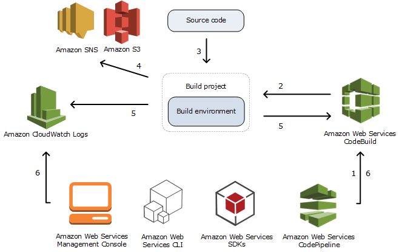

# AWS CodeBuild Concepts
## Cloud Research
Today, I've learned about AWS CodeBuild's workflow which is shown below.

1. As input, you must provide CodeBuild with a build project. A build project includes information about how to run a build, including where to get the source code, which build environment to use, which build commands to run, and where to store the build output. A build environment represents a combination of operating system, programming language runtime, and tools that CodeBuild uses to run a build.

2. CodeBuild uses the build project to create the build environment.

3. CodeBuild downloads the source code into the build environment and then uses the build specification (buildspec), as defined in the build project or included directly in the source code. A buildspec is a collection of build commands and related settings, in YAML format, that CodeBuild uses to run a build.

4. If there is any build output, the build environment uploads its output to an S3 bucket. The build environment can also perform tasks that you specify in the buildspec (for example, sending build notifications to an Amazon SNS topic).

5. While the build is running, the build environment sends information to CodeBuild and Amazon CloudWatch Logs.

6. While the build is running, you can use the AWS CodeBuild console, AWS CLI, or AWS SDKs to get summarized build information from CodeBuild and detailed build information from Amazon CloudWatch Logs. If you use AWS CodePipeline to run builds, you can get limited build information from CodePipeline.

For more information, see a [documentation](https://docs.aws.amazon.com/codebuild/latest/userguide/concepts.html).

## Social Proof
I'm not going to post my progression on social media.
